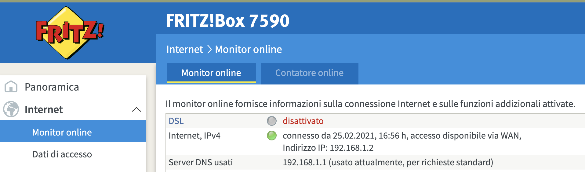

Sections:

- [As router only](#router-only) , used in cascade to `Vodafone Station`

- [NAS](#nas)

NAS
===

Use fritzbox as NAS is simple because it has this functionality out of the box.

I've seen this:

- [Configure USB](https://it.avm.de/assistenza/fritzbox/fritzbox-3272/banca-dati-informativa/publication/show/26_Configurare-una-memoria-USB-collegata-al-FRITZ-Box/)
- [Configure NAS](https://it.avm.de/assistenza/fritzbox/fritzbox-3272/banca-dati-informativa/publication/show/543_Configurare-al-computer-una-memoria-NAS-come-unita-di-rete/)
- [Configure NAS](https://www.youtube.com/watch?v=6w3sIMj0jow), video
- [As MEDIA SERVER](https://www.youtube.com/watch?v=kyzrWXBcH8c), video


### Creazione Utente NAS 

`Sistema > Utenti Fritzbox` per creare un utente: mi serve perche' ad esso devo dare l'`Accesso a contenuti NAS`, e da qui scegliere se a tutte, 
ed inoltre se in lettura/scrittura.

Questo step e' fondamentale perche' per poter sincronizzare i miei files ad esempio con `rsync` o simili, usando come sorgente il mio PC e come destinazione la memoria USB montata come NAS sul FritzBox,
e' necessario che questo risulti essere montanto come risorsa di rete (storage di rete), infatti quando montero' questo volume di rete mi verranno richiesti `username` e `password`. 


GESTIONE USB/NAS
----------------

### USB/MEMORIE

In `Rete Locale > USB/Memorie` faccio quanto segue:

**Dispositivi e ablitazioni nella rete locale**

- `Dispositivi e memorie USB collegati al fritzbox` , qui flaggo tutto (ovvero funziona NAS attiva e aggiornare indice automaticamente). 
- `Impostazioni memoria online` , questo posso lasciarlo NON FLAGGATO
- `Abilitazione nella rete locale` , flacco l'accesso tramite unita' di rete (SMB), inoltre posso usare il `NOME` come DNS, o alternativamente usare l'ip del fritzbox stesso; L'`FTP` sta a me decidere.

Inoltre quando aggiungero' l'unita' di rete al PC, sostanzialmente avro' un'alberatura del tipo:

````
- FRITZ.NAS/ (or name setted above)
           |-- FRITZ (i.e. internal fritz storage)
           |-- <usb memory name>
````

**Impostazioni USB**

Lo lascio cosi' com'e'.

**Connessione remota USB**

Posso non flaggare nulla.


#### mount network device

Dal PC che deve accedere alla risorsa di rete (quindi che utilizzero' per aggiungere/spostare/rimuovere assets), eseguire quanto segue:

- aggiungere la risorsa di rete che rispondera' all'IP del fritzbox, oppure cercare con protocollo `smb://<server>`, 
    dove appunto `server` e' l'IP oppure il nome configurato in `Dispositivi e ablitazioni nella rete locale > Abilitazione nella rete locale`.

- a questo punto usare `password` e `username` dell'utente creato in precedenza e a cui si e' dato l'accesso al NAS.


### Media Server

`Rete Locale > Media Server` invece mi serve appunto per la gestione come media server, 
ovvero come strumento per collegarmi ad esempio con Smart Devices, Smart TV, etc.

In questo caso posso guardare filmati, ascoltare musica, etc, ma assolutamente NON POSSO GESTIRE NULLA:
questo vuol dire che non posso caricare nuove canzoni, rimuoverne o altro... 
e' proprio per questo motivo che mi e' servito abilitarlo come NAS, ovvero per non dover continuamente staccare e riattaccare l'USB dal PC per la gestione dei media.


As router only
==============

Use FritzBox in cascade to `Vodafone Station`, that is use Vodafone Station as modem to gain internet access (and Vodafone Internet Provider montiros it),
and maintain routing and controls with My Fritzbox, for example no lost IP mapping/naming configured into FritzBox and maintain the MESH system benefits.

Fritzbox in cascata Vodafone Station
------------------------------------


### Tratto da quanto segue:


Tratto da https://www.youtube.com/watch?v=8-QXboI3G0k

0. A livello fisico si dovrà usare un cavo Ethernet per collegare una qualsiasi porta Ethernet della Vodafone Station alla porta WAN del FritzBox

1. interfaccia VSR (Vodafone Station Revolution)

    - "internet" > "Host Nat Statico"
    - Nella configurazione normale `Host Nat Statico` e' disabilitato, ma io lo abilito e da `0.0.0.0` che era lo configurao a `192.168.1.3`

2. interfaccia FritzBox

    - Internet > Dati di accesso > "Provider Internet" seleziono "accesso disponibile via WAN" e poi applico
    - ottengo un messaggio tipo `Il FRITZ!Box ha ricevuto un nuovo indirizzo IP ed è ora raggiungibile a 192.168.188.1.`
    - nel mio caso avevo customizzato la `192.168.178.1` quindi devo fare ulteriore passaggio
    - Rete Locale > Rete , Tab "Impostazioni di rete" e da li nella sezione "Indirizzi IP" clicco su "Configurazione IPV4"
    - dall'interfaccia appena raggiunta, posso riconfigurare l'indirizzo ipv4 della rete locale a `192.168.178.1`
    

Fin qui tutto OK, ma di fatto non raggiungevo internet, cosi' guardando nel fritzbox ho visto questa sezione:



dove contrariamente all'immagine, alla riga `Internet,IPv4` il pallino era grigio e di fatto non ero connesso a internet.
Da quella riga però ho ipotizzato che quello doveva essere l'ip del Nat Statico della vodafone station, 
ovvero che in realtà dato che la Vodafone Station nel collegamento Ethernet aveva dato al FritzBox l'IP `192.168.1.2`,
allora questi doveva essere l'ip configurato come NAT STATICO, come in questo screenshot:


Quindi di fatto, almeno nel mio caso, conviene prima collegare gli apparecchi, poi configurare il fritzbox, 
e solo dopo impostare la Vodafone Station come NAT Statico.

Altri dettagli su configurare la Vodafone Station come Modem Alternativo:

- https://www.vodafone.it/portal/Aziende/Piccole-e-Medie-Aziende/Supporto/Rete-fissa/Telefoni-e-dispositivi/Vodafone-Modem-Libero/Parametri-di-configurazione


#### Video

- https://www.youtube.com/watch?v=8-QXboI3G0k , questo spiega bene
- https://www.youtube.com/watch?v=pKjT4Rd5seQ
- https://www.youtube.com/watch?v=3eEfcGqX9Oc , questo giusto per vedere i collegamenti

